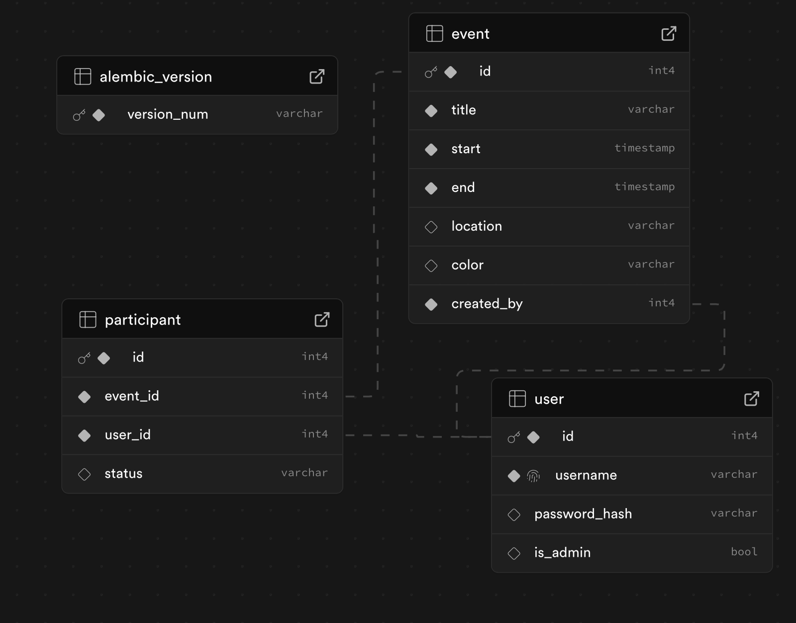

# イベント管理アプリケーション

## 概要

このアプリケーションは、イベントの作成、管理、参加者の追跡を行うためのウェブベースのツールです。Flask、SQLAlchemy、FullCalendar.js、Google Sheets APIを使用して構築されています。Docker環境で実行され、AWS EC2上にデプロイされています。

## 主な機能

- ユーザー認証システム（登録、ログイン、ログアウト）
- イベントのCRUD操作（作成、読み取り、更新、削除）
- インタラクティブなカレンダーインターフェース
- イベント参加登録と参加状況の管理
- 管理者専用機能
- Google Sheets APIを使用したイベントの一括作成
- 多言語対応（日本語・英語）
- レスポンシブデザイン

## 技術スタック

- バックエンド: Python/Flask
- データベース: PostgreSQL
- フロントエンド: HTML, CSS, JavaScript, FullCalendar.js
- コンテナ化: Docker, docker-compose
- デプロイ: AWS EC2
- API統合: Google Sheets API
- 認証: Flask-Login
- 多言語対応: Flask-Babel

## セットアップ手順

### Dockerを使用した開発環境のセットアップ

1. リポジトリのクローン:
   ```bash
   git clone https://github.com/takuaki-taku/event_manager_v5.git
  
  ```markdown project="Event Management App" file="README.md"
...
```


2. 環境変数の設定:

1. `.env`ファイルを作成し、以下の変数を設定:
  以下は例です。


```plaintext
SECRET_KEY=your_secret_key
DATABASE_URL=postgresql://username:password@db:5432/dbname
GOOGLE_SHEETS_CREDENTIALS=your_credentials_json
```


3. Dockerコンテナの起動:

```shellscript
docker-compose up --build
```


4. データベースのマイグレーション:

```shellscript
docker-compose exec web flask db upgrade
```


### Google Sheets API設定

1. Google Cloud Consoleで新しいプロジェクトを作成
2. Google Sheets APIを有効化
3. サービスアカウントを作成しJSONキーをダウンロード
4. 環境変数`GOOGLE_SHEETS_CREDENTIALS`にJSONキーの内容を設定


## 管理者アカウント

デフォルトの管理者アカウント:

- ユーザー名: admin
- パスワード: admin_password


テスト用一般ユーザーアカウント:

- ユーザー名: sample
- パスワード: sample


## データベース構造

主要なテーブル:

- users: ユーザー情報
- events: イベント情報
- participants: 参加者情報


## トラブルシューティング

一般的な問題と解決方法:

1. データベース接続エラー:

1. 環境変数`DATABASE_URL`が正しく設定されているか確認
2. PostgreSQLコンテナが実行中か確認


2. Google Sheets API接続エラー:

1. 認証情報が正しく設定されているか確認
2. APIが有効化されているか確認


## 貢献ガイドライン

1. Issueの作成
2. ブランチの作成（feature/fix）
3. 変更の実装
4. テストの実行
5. プルリクエストの作成


## ライセンス

MIT License

## サポート

問題や質問がある場合は、以下の連絡先までご連絡ください：

- Email: [tatennisku@gmail.com](mailto:tatennisku@gmail.com)
- GitHub Issues


  